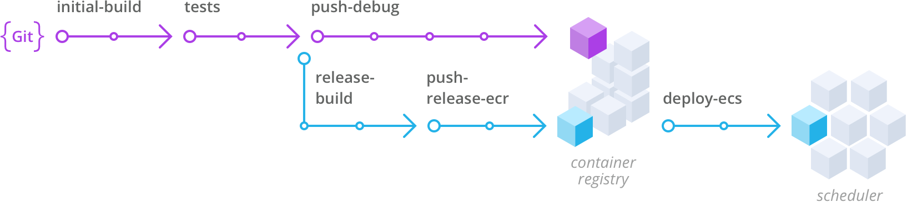

##  Wercker Workflows, Amazon ECR and ECS sample application

Sample Todo application that showcases [Wercker Workflows](http://wercker.com/workflows/) in action alongside [AWS ECR](https://aws.amazon.com/ecr/) and [AWS ECS](https://aws.amazon.com/ecs/)

This sample application shows two Workflows. Please see the `wercker.yml` file for more details.

### Build Development Container

The first Workflow builds our initial image, runs unit tests and pushes our container to a container registry.
We can leverage this container for development purposes and share the container amongst our team.

### Build Production-ready Container

The second Workflow continuous after our test pipeline and builds a production ready container that gets
pushed to a registry.

Finally, we use the [1science/aws-ecs](https://github.com/1science/wercker-aws-ecs) by [1science](https://github.com/1science) to launch our container to Amazon Container Service.

You can see a visual representation of the Workflows below.

